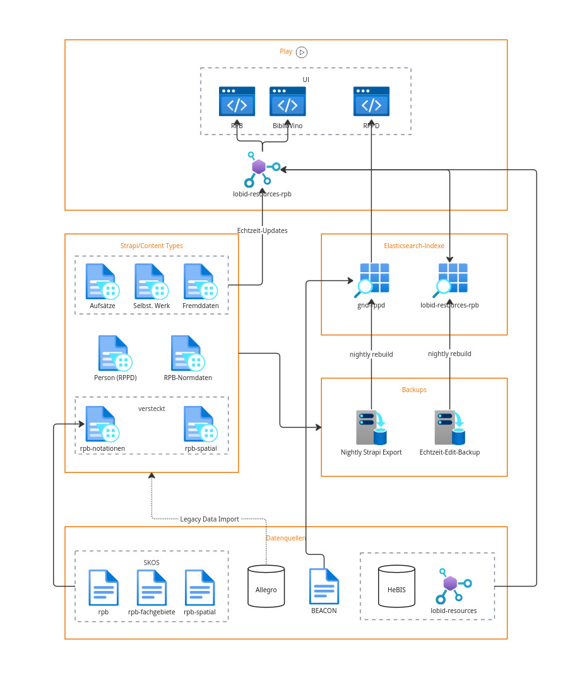

# RPB

[](https://github.com/hbz/rpb/actions?query=workflow%3ABuild)

This repo contains the RPB data transformation and the RPB web application.

## Setup

### Install metafacture dependencies

See `.github/workflows/build.yml`.

### Clone RPB project repo

```bash
git clone https://github.com/hbz/rpb.git
cd rpb
```

## Architectural overview

version 2025-03-28



## Deployment overview

The overall RPB system consists of 4 applications: RPB & BiblioVino (Java/Play, based on [NWBib](https://github.com/hbz/nwbib)), RPPD (Java/Play, based on [lobid-gnd](https://github.com/hbz/lobid-gnd)), and Strapi-RPB (JavaScript/React).

### Proxies and redirects

|     | LBZ-URLs | Lobid-URL | Test-System |
| --- | -------- | --------- | ----------- |
| RPB | https://rpb.lbz-rlp.de<br/> http://www.rpb-rlp.de/ | https://rpb.lobid.org | http://test.rpb.lobid.org |
| BiblioVino |  https://wein.lbz-rlp.de/<br/> http://weinbibliographie.de/ | https://wein.lobid.org | http://test.wein.lobid.org |
| RPPD | http://www.rppd-rlp.de/ | https://rppd.lobid.org | http://test.rppd.lobid.org |
| Strapi | -- | https://rpb-cms.lobid.org/admin<br/>[https://rpb-cms.lobid.org/api/persons?populate=*](https://rpb-cms.lobid.org/api/persons?populate=*) | https://rpb-cms-test.lobid.org/admin<br/> [https://rpb-cms-test.lobid.org/api/persons?populate=*](https://rpb-cms-test.lobid.org/api/persons?populate=*) |

For details on our setup see https://dienst-wiki.hbz-nrw.de/display/SEM/RPB (internal).

### Source code

- RPB: https://github.com/hbz/rpb
- BiblioVino: https://github.com/hbz/rpb/tree/biblioVino
- RPPD: https://github.com/hbz/rppd
- Strapi-RPB: https://github.com/hbz/strapi-rpb

## Transformation development

### Create lookup table

```bash
sbt "runMain rpb.ETL etl/rpb-test-sw.flux"
```

This writes a `.tsv` file to `output/`, to be used for lookups in the transformation.

### Run transformation to strapi data

```bash
sbt "runMain rpb.ETL etl/rpb-test-titel-to-strapi.flux"
```

This writes a single `.json` file to `output/` (it's actually JSON lines, but the suffix makes it work with JSON tools, e.g. for syntax coloring and formatting).

### Import strapi data

```bash
sbt "runMain rpb.ETL etl/rpb-test-titel-import.flux PICK=all_equal('type','u') PATH=articles"
sbt "runMain rpb.ETL etl/rpb-test-titel-import.flux PICK=all_equal('type','Monografie') PATH=independent-works"
sbt "runMain rpb.ETL etl/rpb-test-titel-import.flux PICK=all_equal('type','Band') PATH=independent-works"
sbt "runMain rpb.ETL etl/rpb-test-titel-import.flux PICK=all_equal('f36t','MultiVolumeBook') PATH=independent-works"
```

This attempts to import all data selected with the `PICK` variable to the API endpoint in `PATH`, and prints the server response.

To reimport existing entries, these may need to be deleted first, e.g. for `articles/1` to `articles/5`:

```
curl --request DELETE http://localhost:1337/api/articles/[1-5]
```

After import they are available at e.g. https://rpb-cms-test.lobid.org/api/articles?populate=*

Entries using the same path can be filtered, e.g. to get only volumes (`type=Band`):

https://rpb-cms-test.lobid.org/api/independent-works?filters[type][$eq]=Band&populate=*

### Import SKOS data into strapi

Actual transformation of SKOS TTL files to JSON happens in https://github.com/acka47/scripts/tree/master/skos2json.

To import the resulting JSON data into strapi, run:

```bash
sbt "runMain rpb.ETL etl/rpb-systematik-import.flux INPUT=rpb.ndjson PATH=rpb-notations"
sbt "runMain rpb.ETL etl/rpb-systematik-import.flux INPUT=rpb-spatial.ndjson PATH=rpb-spatials"
```

### Run RPPD transformation to strapi data

```bash
sbt "runMain rpb.ETL etl/rppd-to-strapi.flux"
```

Writes output to `output/output-rppd-strapi.ndjson`.

### Import RPPD strapi data

```bash
sbt "runMain rpb.ETL etl/rppd-import.flux"
```

This attempts to import RPPD data to strapi, and prints the server responses.

Same for RPB-Normdaten (`rpb-sw-to-strapi.flux` / `rpb-sw-import.flux`).

See also `transformAndImportTest.sh` (test data) and `transformAndImportFull.sh` (full data).

### Run transformation to lobid data

```bash
sbt "runMain rpb.ETL etl/rpb-test-titel-to-lobid.flux"
```

This writes individual `.json` files for each record in the input data to `output/`.

### Export strapi data

```bash
sbt "runMain rpb.ETL etl/test-export-strapi-to-lobid.flux"
```

This writes individual `.json` files for Strapi records to `output/`.

### Compare export data

```bash
sbt "runMain rpb.ETL etl/test-export-compare-strapi.flux PICK=all_equal('type','u') PATH=articles"
sbt "runMain rpb.ETL etl/test-export-compare-strapi.flux PICK=all_equal('type','Monografie') PATH=independent-works"
sbt "runMain rpb.ETL etl/test-export-compare-strapi.flux PICK=all_equal('type','Band') PATH=independent-works"
sbt "runMain rpb.ETL etl/test-export-compare-strapi.flux PICK=all_equal('f36t','MultiVolumeBook') PATH=independent-works"
```

This selects parts of the test data and write two files:

1) for each test record, get the data from the Strapi HTTP API, convert the result to the lobid format, write to `test-lobid-output-from-strapi.json`
2) convert each record directly to lobid, write to `test-lobid-output-from-file.json`

We can then compare the two files (e.g. in VSC: Select for Compare, Format Document) to see differences. Since fields that are not defined in the Strapi content types are omitted upon import, missing data here points to missing fields in the Strapi content types.

### Validate output

Prerequisites: `npm install -g ajv-cli ajv-formats`

```bash
sh validateJsonOutput.sh
```

This validates the resulting files against the JSON schemas in `test/rpb/schemas/`.

### Adding test data

During development, you'll sometimes want to add a record with specific fields or values to the test data, e.g. when handling new fields or fixing edge cases in the transformation. Due to the unusual encoding of the input data (`IBM437`), editing the files in a text editor may result in a faulty encoding. Instead, we can use the command line and append to the test data directly with `>>`.

E.g. to add the last record in `etl/RPB-Export_HBZ_Bio.txt` that contains `#82b` to `etl/RPB-Export_HBZ_Bio_Test.txt`:

```bash
cat etl/RPB-Export_HBZ_Bio.txt | grep -a '#82b' | tail -n 1 >> etl/RPB-Export_HBZ_Bio_Test.txt
```

The `-a` is required to return all results since grep views parts of the files as binary data.

### Index creation

If you're not indexing into an existing lobid-resources index, make sure to create one with the proper index settings, e.g. to index into Elasticsearch on `localhost`:

```bash
~/git/rpb$ curl -XPUT -H "Content-Type: application/json" localhost:9200/resources-rpb-20231130-1045?pretty -d @../lobid-resources-rpb/src/main/resources/alma/index-config.json
```

For testing, the real index name (e.g. `resources-rpb-20231130-1045`) is aliased by `resources-rpb-test`, which is used by http://test.rpb.lobid.org and in the transformation.

### Run full transformation and indexing

```bash

sh transformAndIndex.sh
```

## Web application

Start the web application:

### Test mode

```
sbt run
```

### Prod mode

```
sbt stage
./target/universal/stage/bin/rpb -no-version-check
```

http://localhost:9000

## Java development

## Run tests

```bash
sbt "test-only tests.CITests"
```

## Generate Eclipse project for import

```bash
sbt "eclipse with-source=true"
```

## Reconciliation

NOTE: This section is based on the work-in-progress reconciliation service in [lobid-resources](https://github.com/hbz/lobid-resources/pull/1777).

### RPB source data with hbz IDs

Goal: for all RPB entries with an hbz ID in `#983`, create a mapping from the hbz union catalog ID `almaMmsId` to the `rpbId` from `#00 `. With this, during the transformation of the hbz union catalog for lobid-resources, we can make sure that all entries are marked as members of RPB (`containedIn`, `rpbId`).

Create the subset we want to reconcile (all entries with `#983`):

```bash
sbt "runMain rpb.ETL etl/rpb-983.flux"
```

Create an OpenRefine project from the output file `etl/output/rpb-983.json`, selecting "Line-based text files" under "Parse data as". Optionally, limit the number of rows to import ("Load at most [ ] row(s) of data") for faster experimentation with reconciliation results.

In the "Undo / Redo" tab, click "Apply...", paste the content below, then click "Perform Operations".

```json
[
  {
    "op": "core/column-rename",
    "oldColumnName": "Column 1",
    "newColumnName": "Allegro",
    "description": "Rename column Column 1 to Allegro"
  },
  {
    "op": "core/column-addition",
    "engineConfig": {
      "facets": [],
      "mode": "row-based"
    },
    "baseColumnName": "Allegro",
    "expression": "grel:value.parseJson().get('#983')",
    "onError": "set-to-blank",
    "newColumnName": "983",
    "columnInsertIndex": 1,
    "description": "Create column 983 at index 1 based on column Allegro using expression grel:value.parseJson().get('#983')"
  },
  {
    "op": "core/recon",
    "engineConfig": {
      "facets": [],
      "mode": "row-based"
    },
    "columnName": "983",
    "config": {
      "mode": "standard-service",
      "service": "https://test.lobid.org/resources/reconcile",
      "identifierSpace": "https://test.lobid.org/resources",
      "schemaSpace": "http://purl.org/dc/terms/BibliographicResource",
      "type": {
        "id": "BibliographicResource",
        "name": "BibliographicResource"
      },
      "autoMatch": true,
      "columnDetails": [],
      "limit": 0
    },
    "description": "Reconcile cells in column 983 to type BibliographicResource"
  },
  {
    "op": "core/column-addition",
    "engineConfig": {
      "facets": [],
      "mode": "row-based"
    },
    "baseColumnName": "983",
    "expression": "cell.recon.match.id",
    "onError": "set-to-blank",
    "newColumnName": "almaMmsId",
    "columnInsertIndex": 2,
    "description": "Create column almaMmsId at index 2 based on column 983 using expression cell.recon.match.id"
  },
  {
    "op": "core/column-addition",
    "engineConfig": {
      "facets": [],
      "mode": "row-based"
    },
    "baseColumnName": "Allegro",
    "expression": "grel:value.parseJson().get('#00 ')",
    "onError": "set-to-blank",
    "newColumnName": "rpbId",
    "columnInsertIndex": 1,
    "description": "Create column rpbId at index 1 based on column Allegro using expression grel:value.parseJson().get('#00 ')"
  },
  {
    "op": "core/column-move",
    "columnName": "rpbId",
    "index": 3,
    "description": "Move column rpbId to position 3"
  }
]
```

This reconciles the hbz IDs from `#983` with lobid-resources to add a column `almaMmsId`, as well as a column `rpbId` from `#00 `. We can now filter on the matched entries, remove the original data column and the hbz ID column, and export the remaining `almaMmsId` and `rpbId` columns as tab-separated values to be used for lookups in the lobid-resources transformation.

We currently have two output files for this workflow (in `etl/maps/`): `almaMmsId-to-rpbId.tsv`, the actual goal mapping, and `hbzIds-missing-in-alma.tsv`, a mapping of values in `#983` that were not reconciled (some look like proper hbz IDs that seem to be missing in Alma, some look like cataloging errors) to `rpbId` from `#00 `.

### RPB `#36 =sm` data w/o hbz IDs

Create the subset we want to reconcile (entries with `#36 =sm` and no hbz ID in `#983`):

```bash
sbt "runMain rpb.ETL etl/rpb-36sm.flux"
```

Create an OpenRefine project from the output file `etl/output/rpb-36sm.json`, selecting "Line-based text files" under "Parse data as". Optionally, limit the number of rows to import ("Load at most [ ] row(s) of data") for faster experimentation with reconciliation results.

In the "Undo / Redo" tab, click "Apply...", paste the content below, then click "Perform Operations".

```json
[
  {
    "op": "core/column-addition",
    "engineConfig": {
      "facets": [],
      "mode": "row-based"
    },
    "baseColumnName": "Column 1",
    "expression": "grel:value.parseJson().get('#20 ')",
    "onError": "set-to-blank",
    "newColumnName": "20",
    "columnInsertIndex": 0,
    "description": "Create column 20 at index 0 based on column Column 1 using expression grel:value.parseJson().get('#20 ')"
  },
  {
    "op": "core/column-addition",
    "engineConfig": {
      "facets": [],
      "mode": "row-based"
    },
    "baseColumnName": "Column 1",
    "expression": "grel:value.parseJson().get('#19 ')",
    "onError": "set-to-blank",
    "newColumnName": "19",
    "columnInsertIndex": 1,
    "description": "Create column 19 at index 1 based on column Column 1 using expression grel:value.parseJson().get('#19 ')"
  },
  {
    "op": "core/column-addition",
    "engineConfig": {
      "facets": [],
      "mode": "row-based"
    },
    "baseColumnName": "Column 1",
    "expression": "grel:value.parseJson().get('#60 ')",
    "onError": "set-to-blank",
    "newColumnName": "60",
    "columnInsertIndex": 2,
    "description": "Create column 60 at index 2 based on column Column 1 using expression grel:value.parseJson().get('#60 ')"
  },
  {
    "op": "core/text-transform",
    "engineConfig": {
      "facets": [],
      "mode": "row-based"
    },
    "columnName": "60",
    "expression": "grel:replace(value, '_', '')",
    "onError": "keep-original",
    "repeat": false,
    "repeatCount": 10,
    "description": "Text transform on cells in column 60 using expression grel:replace(value, '_', '')"
  },
  {
    "op": "core/text-transform",
    "engineConfig": {
      "facets": [],
      "mode": "row-based"
    },
    "columnName": "60",
    "expression": "grel:replace(value, 'n', '-')",
    "onError": "keep-original",
    "repeat": false,
    "repeatCount": 10,
    "description": "Text transform on cells in column 60 using expression grel:replace(value, 'n', '-')"
  },
  {
    "op": "core/column-addition",
    "engineConfig": {
      "facets": [],
      "mode": "row-based"
    },
    "baseColumnName": "Column 1",
    "expression": "grel:value.parseJson().get('#39 ')",
    "onError": "set-to-blank",
    "newColumnName": "39",
    "columnInsertIndex": 3,
    "description": "Create column 39 at index 3 based on column Column 1 using expression grel:value.parseJson().get('#39 ')"
  },
  {
    "op": "core/column-addition",
    "engineConfig": {
      "facets": [],
      "mode": "row-based"
    },
    "baseColumnName": "Column 1",
    "expression": "grel:value.parseJson().get('#76b')",
    "onError": "set-to-blank",
    "newColumnName": "76b",
    "columnInsertIndex": 4,
    "description": "Create column 76b at index 4 based on column Column 1 using expression grel:value.parseJson().get('#76b')"
  },
  {
    "op": "core/column-addition",
    "engineConfig": {
      "facets": [],
      "mode": "row-based"
    },
    "baseColumnName": "Column 1",
    "expression": "grel:value.parseJson().get('#74 ')",
    "onError": "set-to-blank",
    "newColumnName": "74",
    "columnInsertIndex": 5,
    "description": "Create column 74 at index 5 based on column Column 1 using expression grel:value.parseJson().get('#74 ')"
  },
  {
    "op": "core/column-addition",
    "engineConfig": {
      "facets": [],
      "mode": "row-based"
    },
    "baseColumnName": "Column 1",
    "expression": "grel:value.parseJson().get('#75 ')",
    "onError": "set-to-blank",
    "newColumnName": "75",
    "columnInsertIndex": 6,
    "description": "Create column 75 at index 6 based on column Column 1 using expression grel:value.parseJson().get('#75 ')"
  },
  {
    "op": "core/column-addition",
    "engineConfig": {
      "facets": [],
      "mode": "row-based"
    },
    "baseColumnName": "Column 1",
    "expression": "grel:\"http://www.rpb-rlp.de/\" + value.parseJson().get('#00 ')",
    "onError": "set-to-blank",
    "newColumnName": "rpbUrl",
    "columnInsertIndex": 0,
    "description": "Create column rpbUrl at index 0 based on column Column 1 using expression grel:\"http://www.rpb-rlp.de/\" + value.parseJson().get('#00 ')"
  },
  {
    "op": "core/column-addition",
    "engineConfig": {
      "facets": [],
      "mode": "row-based"
    },
    "baseColumnName": "20",
    "expression": "grel:value",
    "onError": "set-to-blank",
    "newColumnName": "20-original",
    "columnInsertIndex": 2,
    "description": "Create column 20-original at index 2 based on column 20 using expression grel:value"
  },
  {
    "op": "core/column-rename",
    "oldColumnName": "20",
    "newColumnName": "lobidMatch",
    "description": "Rename column 20 to lobidMatch"
  },
  {
    "op": "core/recon",
    "engineConfig": {
      "facets": [],
      "mode": "row-based"
    },
    "columnName": "lobidMatch",
    "config": {
      "mode": "standard-service",
      "service": "http://test.lobid.org/resources/reconcile",
      "identifierSpace": "http://test.lobid.org/resources",
      "schemaSpace": "http://purl.org/dc/terms/BibliographicResource",
      "type": {
        "id": "(Series OR Journal OR EditedVolume OR MultiVolumeBook OR Periodical OR Bibliography) AND NOT (Article OR PublicationIssue)",
        "name": "Überordnungen"
      },
      "autoMatch": true,
      "columnDetails": [
        {
          "column": "19",
          "propertyName": "Ansetzungssachtitel",
          "propertyID": "alternativeTitle"
        },
        {
          "column": "60",
          "propertyName": "HE Urheber",
          "propertyID": "contribution.agent.gndIdentifier"
        },
        {
          "column": "39",
          "propertyName": "Verfasserangabe",
          "propertyID": "contribution.agent.label"
        },
        {
          "column": "76b",
          "propertyName": "Erscheinungsjahr",
          "propertyID": "publication.startDate"
        },
        {
          "column": "76b",
          "propertyName": "Erscheinungsverlauf",
          "propertyID": "publication.publicationHistory"
        },
        {
          "column": "74",
          "propertyName": "Verlagsort",
          "propertyID": "publication.location"
        },
        {
          "column": "75",
          "propertyName": "Verlag",
          "propertyID": "publication.publishedBy"
        }
      ],
      "limit": 0
    },
    "description": "Reconcile cells in column lobidMatch to type Überordnungen"
  },
  {
    "op": "core/column-addition",
    "engineConfig": {
      "facets": [],
      "mode": "row-based"
    },
    "baseColumnName": "lobidMatch",
    "expression": "cell.recon.match.id",
    "onError": "set-to-blank",
    "newColumnName": "almaMmsId",
    "columnInsertIndex": 2,
    "description": "Create column almaMmsId at index 2 based on column lobidMatch using expression cell.recon.match.id"
  }
]
```

The resulting matches can be exported (for comparing reconciliation with different settings etc.): Export -> Templating..., Row template: `{{cells["almaMmsId"].value}}`.

You should now have a project with 8138 rows, each with 8 columns: data from fields `#20 `, `#19 `, `#60 `, `#39 `, `#76b`, `#74 `, `#75 ` and the full JSON record. Based on that, we reconciled the `20` column, now renamed to `lobidMatch`, including data from columns `19`, `60`, `39`, `76b`, `74`, and `75`. We can now check the matched / unmatched entries in the Facet / Filter tab (to restore the facet, select the `lobidMatch` column > Reconcile > Facets > By judgement).

After we're done with any manual matching, we can prepare the data for the resulting mapping of `almaMmsId` to `rpbId`:

```json
[
  {
    "op": "core/column-removal",
    "columnName": "almaMmsId",
    "description": "Remove column almaMmsId"
  },
  {
    "op": "core/column-addition",
    "engineConfig": {
      "facets": [],
      "mode": "record-based"
    },
    "baseColumnName": "lobidMatch",
    "expression": "cell.recon.match.id",
    "onError": "set-to-blank",
    "newColumnName": "almaMmsId",
    "columnInsertIndex": 2,
    "description": "Create column almaMmsId at index 2 based on column lobidMatch using expression cell.recon.match.id"
  },
  {
    "op": "core/column-addition",
    "engineConfig": {
      "facets": [
        {
          "type": "list",
          "name": "almaMmsId",
          "expression": "isBlank(value)",
          "columnName": "almaMmsId",
          "invert": false,
          "omitBlank": false,
          "omitError": false,
          "selection": [
            {
              "v": {
                "v": false,
                "l": "false"
              }
            }
          ],
          "selectBlank": false,
          "selectError": false
        }
      ],
      "mode": "row-based"
    },
    "baseColumnName": "Column 1",
    "expression": "grel:\"RPB\" + value.parseJson().get(\"#00 \")",
    "onError": "set-to-blank",
    "newColumnName": "rpbId",
    "columnInsertIndex": 3,
    "description": "Create column rpbId at index 3 based on column Column 1 using expression grel:\"RPB\" + value.parseJson().get(\"#00 \")"
  }
]
```

The final result can then be exported (Export -> Custom tabular exporter) to a *.tsv file with two columns mapping `almaMmsId` to `rpbId`, to be used in the union catalog transformation to add the `rpbId` value for each `almaMmsId`.

### RPB `#36 =s` data w/o hbz IDs

NOTE: This section is work in progress, see [RPB-51](https://jira.hbz-nrw.de/browse/RPB-51).

Create the subset we want to reconcile (entries with `#36 =s` and no hbz ID in `#983`):

```bash
sbt "runMain rpb.ETL etl/rpb-36s.flux"
```

Create an OpenRefine project from the output file `etl/output/rpb-36s.json`, selecting "Line-based text files" under "Parse data as". Since the full data is relatively large, limit the number of rows to import ("Load at most [ ] row(s) of data") for faster experimentation with reconciliation results.

In the "Undo / Redo" tab, click "Apply...", paste the content below, then click "Perform Operations".

```json
[
  {
    "op": "core/column-addition",
    "engineConfig": {
      "facets": [],
      "mode": "row-based"
    },
    "baseColumnName": "Column 1",
    "expression": "grel:value.parseJson().get('#20 ')",
    "onError": "set-to-blank",
    "newColumnName": "20",
    "columnInsertIndex": 0,
    "description": "Create column 20 at index 0 based on column Column 1 using expression grel:value.parseJson().get('#20 ')"
  },
  {
    "op": "core/column-addition",
    "engineConfig": {
      "facets": [],
      "mode": "row-based"
    },
    "baseColumnName": "Column 1",
    "expression": "grel:value.parseJson().get('#19 ')",
    "onError": "set-to-blank",
    "newColumnName": "19",
    "columnInsertIndex": 1,
    "description": "Create column 19 at index 1 based on column Column 1 using expression grel:value.parseJson().get('#19 ')"
  },
  {
    "op": "core/column-addition",
    "engineConfig": {
      "facets": [],
      "mode": "row-based"
    },
    "baseColumnName": "Column 1",
    "expression": "grel:value.parseJson().get('#60 ')",
    "onError": "set-to-blank",
    "newColumnName": "60",
    "columnInsertIndex": 2,
    "description": "Create column 60 at index 2 based on column Column 1 using expression grel:value.parseJson().get('#60 ')"
  },
  {
    "op": "core/text-transform",
    "engineConfig": {
      "facets": [],
      "mode": "row-based"
    },
    "columnName": "60",
    "expression": "grel:replace(value, '_', '')",
    "onError": "keep-original",
    "repeat": false,
    "repeatCount": 10,
    "description": "Text transform on cells in column 60 using expression grel:replace(value, '_', '')"
  },
  {
    "op": "core/text-transform",
    "engineConfig": {
      "facets": [],
      "mode": "row-based"
    },
    "columnName": "60",
    "expression": "grel:replace(value, 'n', '-')",
    "onError": "keep-original",
    "repeat": false,
    "repeatCount": 10,
    "description": "Text transform on cells in column 60 using expression grel:replace(value, 'n', '-')"
  },
  {
    "op": "core/column-addition",
    "engineConfig": {
      "facets": [],
      "mode": "row-based"
    },
    "baseColumnName": "Column 1",
    "expression": "grel:value.parseJson().get('#39 ')",
    "onError": "set-to-blank",
    "newColumnName": "39",
    "columnInsertIndex": 3,
    "description": "Create column 39 at index 3 based on column Column 1 using expression grel:value.parseJson().get('#39 ')"
  },
  {
    "op": "core/column-addition",
    "engineConfig": {
      "facets": [],
      "mode": "row-based"
    },
    "baseColumnName": "Column 1",
    "expression": "grel:value.parseJson().get('#76b')",
    "onError": "set-to-blank",
    "newColumnName": "76b",
    "columnInsertIndex": 4,
    "description": "Create column 76b at index 4 based on column Column 1 using expression grel:value.parseJson().get('#76b')"
  },
  {
    "op": "core/column-addition",
    "engineConfig": {
      "facets": [],
      "mode": "row-based"
    },
    "baseColumnName": "Column 1",
    "expression": "grel:value.parseJson().get('#74 ')",
    "onError": "set-to-blank",
    "newColumnName": "74",
    "columnInsertIndex": 5,
    "description": "Create column 74 at index 5 based on column Column 1 using expression grel:value.parseJson().get('#74 ')"
  },
  {
    "op": "core/column-addition",
    "engineConfig": {
      "facets": [],
      "mode": "row-based"
    },
    "baseColumnName": "Column 1",
    "expression": "grel:value.parseJson().get('#75 ')",
    "onError": "set-to-blank",
    "newColumnName": "75",
    "columnInsertIndex": 6,
    "description": "Create column 75 at index 6 based on column Column 1 using expression grel:value.parseJson().get('#75 ')"
  },
  {
    "op": "core/column-addition",
    "engineConfig": {
      "facets": [],
      "mode": "row-based"
    },
    "baseColumnName": "Column 1",
    "expression": "grel:value.parseJson().get('#27 ')",
    "onError": "set-to-blank",
    "newColumnName": "27",
    "columnInsertIndex": 7,
    "description": "Create column 27 at index 7 based on column Column 1 using expression grel:value.parseJson().get('#27 ')"
  },
  {
    "op": "core/column-addition",
    "engineConfig": {
      "facets": [],
      "mode": "row-based"
    },
    "baseColumnName": "Column 1",
    "expression": "grel:value.parseJson().get('#85 ')",
    "onError": "set-to-blank",
    "newColumnName": "85",
    "columnInsertIndex": 8,
    "description": "Create column 85 at index 8 based on column Column 1 using expression grel:value.parseJson().get('#85 ')"
  },
  {
    "op": "core/column-addition",
    "engineConfig": {
      "facets": [],
      "mode": "row-based"
    },
    "baseColumnName": "Column 1",
    "expression": "grel:\"http://www.rpb-rlp.de/\" + value.parseJson().get('#00 ')",
    "onError": "set-to-blank",
    "newColumnName": "rpbUrl",
    "columnInsertIndex": 0,
    "description": "Create column rpbUrl at index 0 based on column Column 1 using expression grel:\"http://www.rpb-rlp.de/\" + value.parseJson().get('#00 ')"
  },
  {
    "op": "core/column-addition",
    "engineConfig": {
      "facets": [],
      "mode": "row-based"
    },
    "baseColumnName": "20",
    "expression": "grel:value",
    "onError": "set-to-blank",
    "newColumnName": "20-original",
    "columnInsertIndex": 2,
    "description": "Create column 20-original at index 2 based on column 20 using expression grel:value"
  },
  {
    "op": "core/column-rename",
    "oldColumnName": "20",
    "newColumnName": "lobidMatch",
    "description": "Rename column 20 to lobidMatch"
  },
  {
    "op": "core/text-transform",
    "engineConfig": {
      "facets": [],
      "mode": "row-based"
    },
    "columnName": "lobidMatch",
    "expression": "grel:if(cells[\"27\"].value == null, value, cells[\"27\"].value + \" \" + value)",
    "onError": "keep-original",
    "repeat": false,
    "repeatCount": 10,
    "description": "Text transform on cells in column lobidMatch using expression grel:if(cells[\"27\"].value == null, value, cells[\"27\"].value + \" \" + value)"
  },
  {
    "op": "core/recon",
    "engineConfig": {
      "facets": [],
      "mode": "row-based"
    },
    "columnName": "lobidMatch",
    "config": {
      "mode": "standard-service",
      "service": "http://test.lobid.org/resources/reconcile",
      "identifierSpace": "http://test.lobid.org/resources",
      "schemaSpace": "http://purl.org/dc/terms/BibliographicResource",
      "type": {
        "id": "Book AND NOT (Series OR Journal OR EditedVolume OR MultiVolumeBook OR Periodical OR Bibliography OR Article OR PublicationIssue)",
        "name": "Monographie"
      },
      "autoMatch": true,
      "columnDetails": [
        {
          "column": "19",
          "propertyName": "Ansetzungssachtitel",
          "propertyID": "alternativeTitle"
        },
        {
          "column": "60",
          "propertyName": "HE Urheber",
          "propertyID": "contribution.agent.gndIdentifier"
        },
        {
          "column": "39",
          "propertyName": "Verfasserangabe",
          "propertyID": "contribution.agent.label"
        },
        {
          "column": "76b",
          "propertyName": "Erscheinungsjahr",
          "propertyID": "publication.startDate"
        },
        {
          "column": "76b",
          "propertyName": "Erscheinungsverlauf",
          "propertyID": "publication.publicationHistory"
        },
        {
          "column": "74",
          "propertyName": "Verlagsort",
          "propertyID": "publication.location"
        },
        {
          "column": "75",
          "propertyName": "Verlag",
          "propertyID": "publication.publishedBy"
        },
        {
          "column": "85",
          "propertyName": "Serie",
          "propertyID": "_all"
        }
      ],
      "limit": 0
    },
    "description": "Reconcile cells in column lobidMatch to type Monographie"
  },
  {
    "op": "core/column-addition",
    "engineConfig": {
      "facets": [],
      "mode": "row-based"
    },
    "baseColumnName": "lobidMatch",
    "expression": "cell.recon.match.id",
    "onError": "set-to-blank",
    "newColumnName": "almaMmsId",
    "columnInsertIndex": 2,
    "description": "Create column almaMmsId at index 2 based on column lobidMatch using expression cell.recon.match.id"
  }
]
```

The resulting matches can be exported (for comparing reconciliation with different settings etc.): Export -> Templating..., Row template: `{{cells["almaMmsId"].value}}`.
