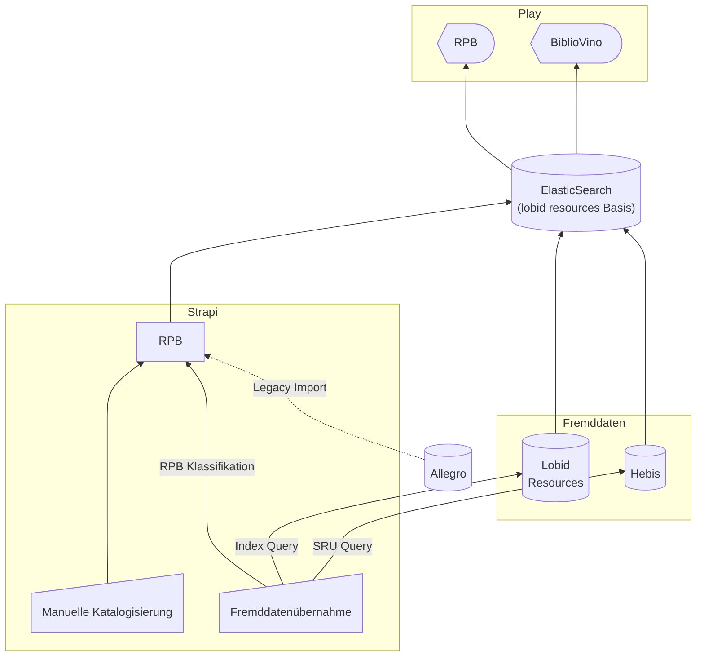

```mermaid
flowchart BT
n1["Allegro"] -.Legacy Import.-> n4
 subgraph s0["Fremddaten"]
        n2["Lobid<br>Resources"]
        n3["Hebis"]
  end
 subgraph s1["Strapi"]
        n4["RPB"]
        n5["Manuelle Katalogisierung"]
        n6["Fremddatenübernahme"]
  end
n7["ElasticSearch<br>(lobid resources Basis)"]
 subgraph s3["Play"]
        n8["RPB"]
        n10["BiblioVino"]
  end

    n2 ----> n7
    n3 ----> n7
    n4 --> n7
    n5 ---> n4
    n6 --RPB Klassifikation--> n4
    n6 -- Index Query--> n2
    n6 --SRU Query--> n3
    n7 --> n8
    n7 ---> n10


    n2@{ shape: db}
    n3@{ shape: db}
    n7@{ shape: db}
    n8@{ shape: display}
    n10@{ shape: display}
    n1@{ shape: db}
    n6@{ shape: manual-input}
    n5@{ shape: manual-input}
```
