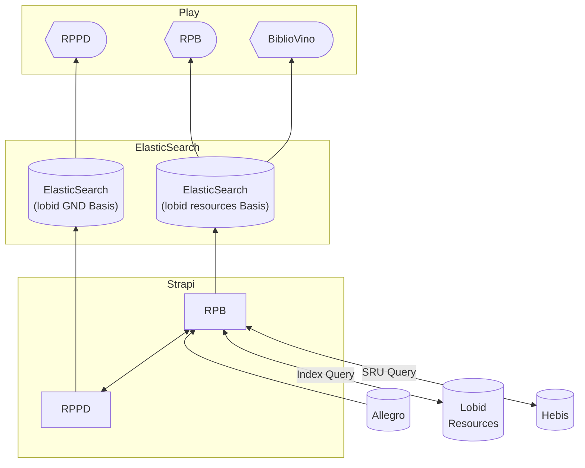

```mermaid
flowchart BT
    n1["Allegro"] --> n4
    n2["Lobid<br>Resources"] <-- Index Query --> n4
    n3["Hebis"] <-- SRU Query --> n4

    subgraph s1["Strapi"]
        n4["RPB"]
        n5["RPPD"]
    end
    subgraph s2["ElasticSearch"]
        n6["RPB"]
        n7["RPPD"]
    end
      subgraph s3["Play"]
        n8["RPB"]
        n9["RPPD"]
        n10["BiblioVino"]
    end

    n4 --> n6["ElasticSearch<br>(lobid resources Basis)"]
    n5 --> n7["ElasticSearch<br>(lobid GND Basis)"]
    n6 --> n8["RPB"]
    n5 <--> n4
    n7 --->n9
    n6 --->n10

    n1@{ shape: db}
    n2@{ shape: db}
    n3@{ shape: db}
    n6@{ shape: db}
    n8@{ shape: display}
    n7@{ shape: db}
    n9@{ shape: display}
    n10@{ shape: display}
```
