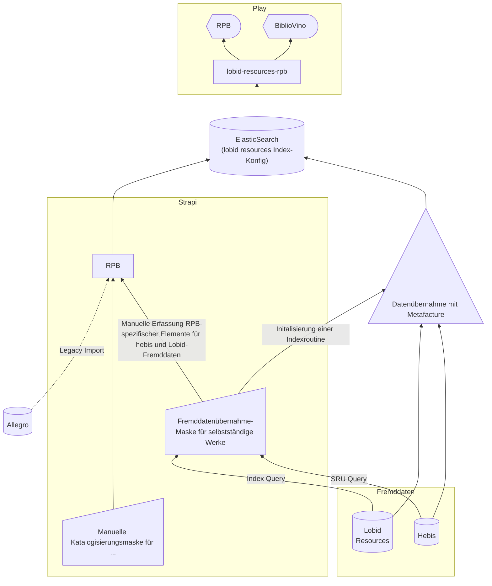

```mermaid
flowchart BT
 subgraph s0["Fremddaten"]
        n2["Lobid<br>Resources"]
        n3["Hebis"]
  end
 subgraph s1["Strapi"]
        n4["RPB"]
        n5["Manuelle Katalogisierungsmaske für ..."]
        n6["Fremddatenübernahme-Maske für selbstständige Werke"]
  end
  n7["ElasticSearch<br>(lobid resources Index-Konfig)"]
 subgraph s3["Play"]
        n9["RPB"]
        n10["BiblioVino"]
        n8["lobid-resources-rpb"]
  end
    n1["Allegro"] -. Legacy Import .-> n4
    n8 --> n9 & n10
    n4 --> n7
    n5 ---> n4
    n6 -- "Manuelle Erfassung RPB-spezifischer Elemente für hebis und Lobid-Fremddaten" --> n4
    n2 -- Index Query --> n6
    n3 -- SRU Query --> n6
    n6 --"Initalisierung einer Indexroutine"-->n11
    n2 -->n11
    n3 -->n11 
    n7 --> n8
    n11["Datenübernahme mit Metafacture"] -->n7

    n2@{ shape: db}
    n3@{ shape: db}
    n5@{ shape: manual-input}
    n6@{ shape: manual-input}
    n9@{ shape: display}
    n10@{ shape: display}
    n1@{ shape: db}
    n7@{ shape: db}
    n11@{ shape: extract}


```
